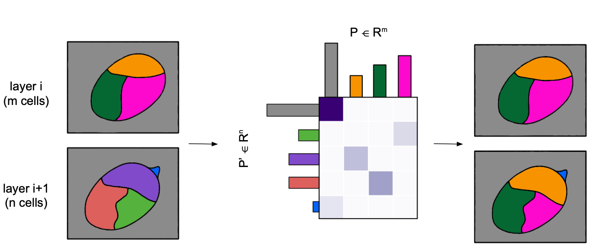

# CellStitch: 3D Cellular Segmentation via Optimal Transport 
 

## Installation
### Conda setup
```bash
conda create -n cellstitch-instanseg python=3.9
conda activate cellstitch-instanseg
```
### Clone repo and install
```bash
git clone https://github.com/Tomvl117/cellstitch-instanseg.git
cd cellstitch-instanseg
pip install -e .
```
### GPU acceleration (Windows)
```bash
conda install pytorch==2.1.1 pytorch-cuda=12.1 -c conda-forge -c pytorch -c nvidia
```


## Instructions
Our implementation of the algorithm is in `./cellstitch/`; you can git clone our repository and install the package locally. Example usage can be found [here](https://github.com/imyiningliu/cellstitch/blob/main/notebooks/example.ipynb). 
